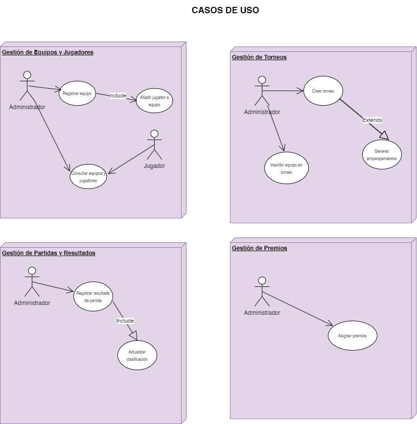
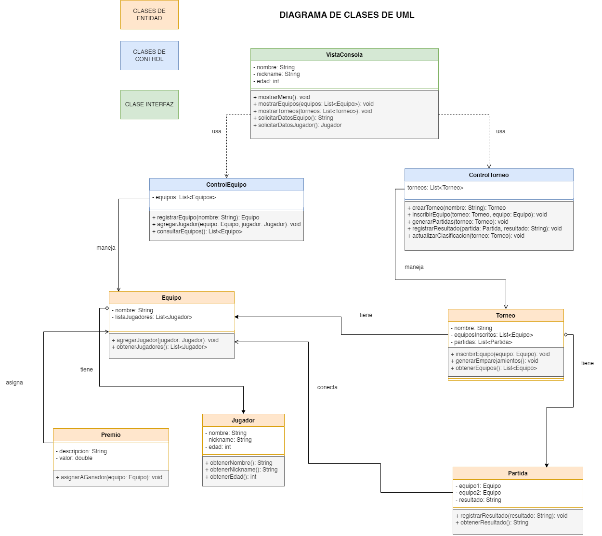

# Sistema de Gestión de Torneos de eSports 
 
## Autor 
Mateo Paredes Vega
github.com/Mateopv1

 
## Descripción del Proyecto 
 
Link al repositorio del proyecto 
https://github.com/Mateopv1/torneo-esports-uml.git

Este proyecto implementa un sistema de gestión de torneos de eSports 
utilizando UML para el modelado y Java para la implementación. 
 
## Diagramas UML 
### Diagrama de Casos de Uso 
 
 
### Diagrama de Clases 
 
 
## Estructura del Proyecto 
 ```torneo-esports-uml/ ├── src/ 
│ ├── es/empresa/torneo/ 
│ │ ├── modelo/ 
│ │ ├── control/ 
│ │ ├── vista/ 
│ │ ├── Main.java 
├── diagrams/ 
│ ├── casos-uso.png 
│ ├── clases.png 
├── README.md 
├── .gitignore 
├── LICENSE (opcional)
```
 
 
## Instalación y Ejecución 
1. Clonar el repositorio: 
`git clone https://github.com/usuario/torneo-esports-uml.git` 
 
2. Compilar y ejecutar el proyecto: 
`cd src javac es/empresa/torneo/Main.java java es.empresa.torneo.Main` 
 
## Justificación del diseño 
Para la realización de los diagramas he utilizado la herramienta Draw.io, que facilita la creación visual de las clases y sus relaciones. Además, he trabajado en el entorno de desarrollo IntelliJ IDEA para complementar el diseño con la estructura en Java (aunque de forma superficial, ya que me limité principalmente a la realización de los diagramas por falta de tiempo).

Aunque inicialmente la actividad parecía sencilla, en la práctica resultó ser más compleja, especialmente en la elaboración del diagrama de clases. La principal dificultad fue no tener claro desde un principio cómo debía representarse de forma correcta cada relación entre las clases, ni la aplicación precisa de los diferentes tipos de asociaciones (dependencias, composiciones, etc.).

A lo largo de la actividad he sentido cierta desconformidad con la asignatura, ya que, pese al esfuerzo, no sentí haber entendido completamente algunos de los conceptos. En ocasiones, los enunciados de las actividades me resultaron confusos, lo que me llevó a tener que buscar información adicional en otros medios para poder comprender bien lo que se pedía. Esto me generó una sensación de inseguridad al desarrollar el ejercicio.

En cuanto a la estructura y lógica del diseño, se ha seguido un enfoque de análisis del problema y requisitos, donde se identificaron los actores principales (por ejemplo, usuario del sistema o administrador del torneo) y las funcionalidades clave (gestionar equipos, inscribir jugadores, crear torneos, registrar resultados, etc.). A partir de este análisis, se diseñaron los diagramas de uso y de clases UML.

La estructura final del diagrama se organizó separando las clases en tres categorías principales: clases de entidad, clases de control y clase de interfaz, lo que facilita reflejar de manera ordenada y lógica el funcionamiento y la interacción de los diferentes componentes del sistema.
## Conclusiones  
Me ha parecido interesante, pero, como mencioné anteriormente, siento que no estoy completamente seguro de lo que estoy haciendo, ya que no cuento con referencias claras. Espero que, al corregirse esta actividad, se aclaren mis dudas y pueda realizar ejercicios posteriores con mayor fluidez y tranquilidad.